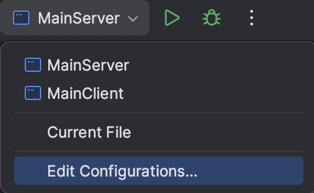
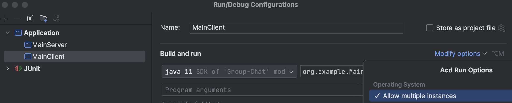

<a href="!!!ссылка!!!" target="_blank">!!!Название ссылки!!!</a>

**Курсовой проект "Сетевой чат"**

В рамках курсового проекта разработан сервис для обмена 
тестовыми сообщениями по сети с помощью консоли между двумя и
более пользователями.

В директории **<a href="org/example/ClientService" target="_blank">ClientService</a>** расположен класс *<a href="org/example/ClientService/Client.java" target="_blank">Client</a>* для подключения
к серверу чата. 

Класс *Client* наследуется от Thread, в методе run() 
которого определены два потока: messageSender для осуществления доставки 
сообщений от клиента и messageReader для получения сообщений клиентом от сервера.

В директории **<a href="org/example/ServerService" target="_blank">ServerService</a>** определены классы, связанные с работой сервера:

*<a href="org/example/ServerService/Server.java" target="_blank">Server</a>* - класс наследуется от Thread, запускается в отдельном потоке. 
В методе run() определен "бесконечный" цикл ожидания подключения новых клиентов,
пока сервер не закрыт. При подключении нового клиента создаётся экземпляр *ClientHandler*, 
который передается в метод execute() класса ExecutorService для обработки клиента в отдельном потоке.

*<a href="org/example/ServerService/ClientHandler.java" target="_blank">ClientHandler</a>* реализует интерфейс Runnable для независимой друг от друга обработки каждого клиента. 
Класс обрабатывает регистрацию клиента, отправку и получение сообщений пока работает сервер.
Конструктор ClientHandler принимает параметр Socket представляющий соединение клиента, настраивает 
потоки ввода и вывода, инициализирует MessageCentre и получает экземпляр MyLogger.
При запуске запрашивается имя пользователя, запускается процесс регистрации клиента registrate(), 
по его окончанию выполняется listenMessage(), который непрерывно слушает входящие сообщения от клиента и обращается к работе
MessageCentre для рассылки сообщений.

*<a href="org/example/ServerService/Clients.java" target="_blank">Clients</a>*
Класс отвечает за синхронизированный доступ к списку клиентских обработчиков: добавление addClient(), удаление removeClient() 
и получение экземпляра списка из ClientHandler через public метод getClientsList()

*<a href="org/example/ServerService/MessageCentre.java" target="_blank">MessageCentre</a>*
Класс, объект которого должен быть связан только с одним ClientHandler. 
Главной задачей класса MessageCentre является рассылка сообщений методом sendMessageToChatExceptSender() 
всем участникам группы, кроме самого отправителя. Для отправки сообщения от пользователя к пользователю, в классе имеется приватный 
метод sendMessageToConcreteClient(). Также в классе метод greeting() уведомляет участников группы 
о присоединении нового пользователя после введения пользователем username в классе ClientHandler в методе registrate().
Метод wantToLeftChat() проверяет исходящие от клиента сообщения на содержание строки "/exit", провоцирующей выход клиента из группового чата.

*<a href="org/example/ServerService/Settings.java" target="_blank">Settings</a>*
Класс, отвечающий за установку порта и его получение.

Общий класс *<a href="org/example/MyLogger.java" target="_blank">MyLogger</a>*
Класс - синглтон, содержащий собственный экземпляр утилитного класса Logger. Предоставляет данный Logger классам для 
логирования шагов выполнения программы и возникающих ошибок.

Для проведения ***интеграционного тестирования*** необходимо запустить сервер, например, из IntelliJ IDEA. 
Затем для запуска нескольких клиентов с одного устройства можно также воспользоваться возможностями IntelliJ IDEA, 
добавив в настройках конфигурации класса MainClient множественный запуск экземпляров данного класса.

